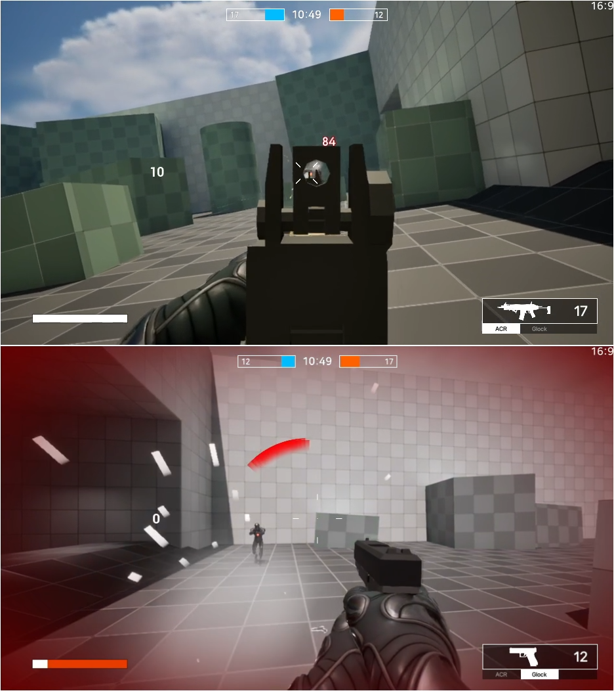

Unreal Engine 멀티플레이 FPS 프로젝트.

---

# NL_GAS

## 소개
**NL_GAS**는 Unreal Engine의 게임플레이 어빌리티 시스템(GAS)을 활용해 개인적으로 진행중인 멀티플레이 FPS 프로젝트 입니다. 하이퍼 FPS의 느낌을 추구합니다.

[간단한 팀 데스 매치 데모](https://youtu.be/DbKV348hhQA?si=sHLWVcOQB6X_JYoq)

Unreal Engine 버전: `5.3`

## Lyra 에셋

Lyra Starter Game의 에셋을 사용중입니다.

**Lyra Start Game** 프로젝트에서 `Contents/Characters/Heroes/Mannequin` 폴더를 **NL_GAS**의 `Contents/Assets/Lyra`에 `이주`해야합니다.

**NL_GAS**에서 `Mannequin` 폴더의 경로는 `Contents/Assets/Lyra/Characters/Heroes/Mannequin` 으로 되어야합니다.

`Migrate` the `Contents/Characters/Heroes/Mannequin` folder from the Lyra Starter Game project to `Contents/Assets/Lyra` in the **NL_GAS** project.

The path for the `Mannequin` folder in **NL_GAS** will be `Contents/Assets/Lyra/Characters/Heroes/Mannequin`.